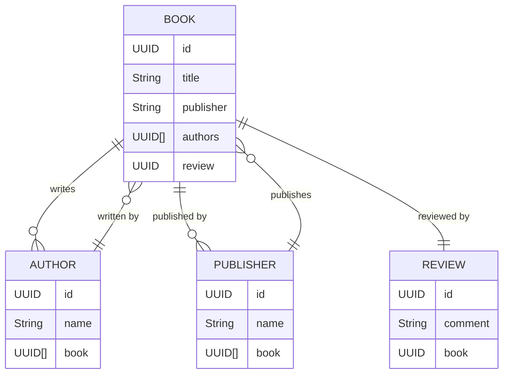

# Projeto de API Simples para publicar no Railway

## Gráfico de referência para as classes

# Principais Tecnologias
* Java 21: Utilizei essa versão do Java como uma forma de me atualizar;
* Spring Boot 3: Maximiza a produtividade do desenvolvedor por meio de sua poderosa premissa de autoconfiguração;
* Spring Data JPA: Explorei como essa ferramenta pode simplificar nossa camada de acesso aos dados, facilitando a integração com bancos de dados SQL;
* OpenAPI (Swagger): Criei uma documentação de API eficaz e fácil de entender usando a OpenAPI (Swagger), perfeitamente alinhada com a alta produtividade que o Spring Boot oferece;
* Railway: facilita o deploy e monitoramento de nossas soluções na nuvem, além de oferecer diversos bancos de dados como serviço e pipelines de CI/CD.
